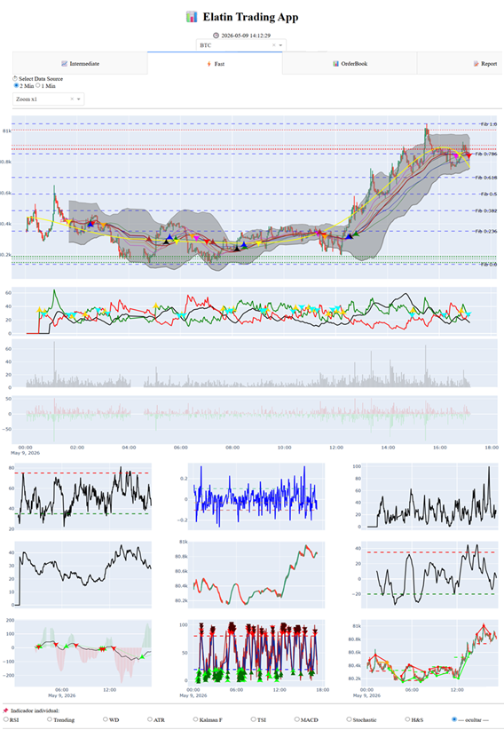
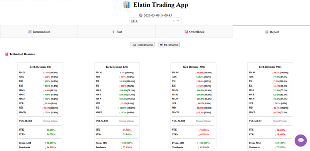
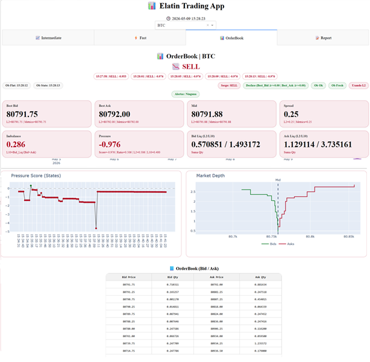
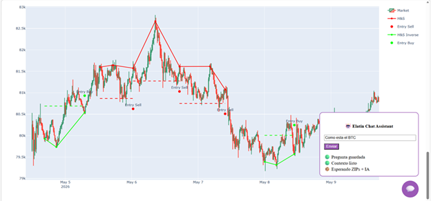
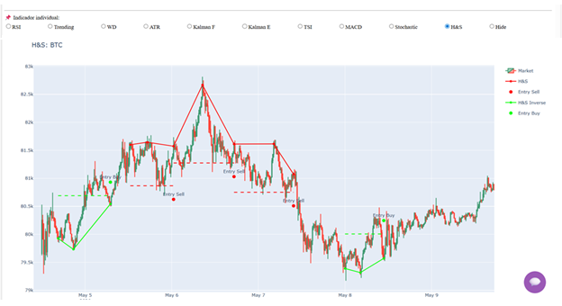

CryptoAnalyst
CryptoAnalyst is a prototype trading research application focused on technical market analysis, chart/image interpretation, ML-assisted signal processing, and trader decision support.

Objective

This project demonstrates a custom-built trading analysis workflow designed to support:
\- Market structure analysis
\- Technical pattern recognition
\- Chart/image-based analysis
\- ML-assisted feature processing
\- Trader dashboard visualization
\- Decision-support reporting
\## Current Application Structure


```text
CryptoAnalyst/
&#x20; Chatbot/
&#x20; HMI/
&#x20; MLFramework/
&#x20; TechAnalyze/


Main Components
Chatbot
Assistant and reporting layer designed to explain market context and summarize trade-relevant insights.

HMI
User interface layer for visualizing technical analysis, market structures, model outputs, and decision-support information.

MLFramework
Machine-learning framework for processing market features and supporting signal classification.

TechAnalyze
Technical analysis engine focused on price structures, trend behavior, support/resistance zones, patterns, and market context.


Portfolio Relevance
This project is part of a Trader Analyst portfolio focused on:

Technical analysis
Market structure interpretation

Data-driven trading research
Crypto market monitoring

Decision-support tooling
Clear communication of technical findings

Current Status
This is an active prototype. The current repository is prepared as a portfolio-safe version and does not include private credentials, real broker accounts, private trading records, or sensitive execution logic.


Disclaimer
This project is for research and portfolio demonstration purposes only. It is not financial advice and does not guarantee trading performance.

Screenshots
Main HMI


Technical Resume


OrderBook View


ChatBot View


### Extra Plot Patterns


